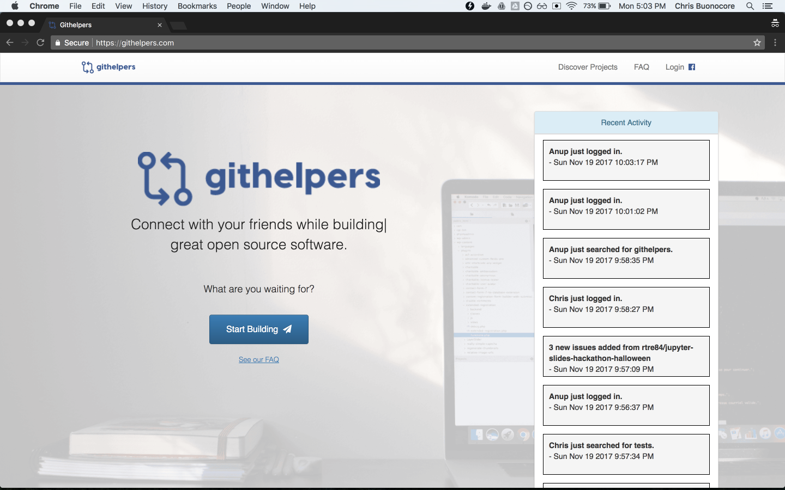
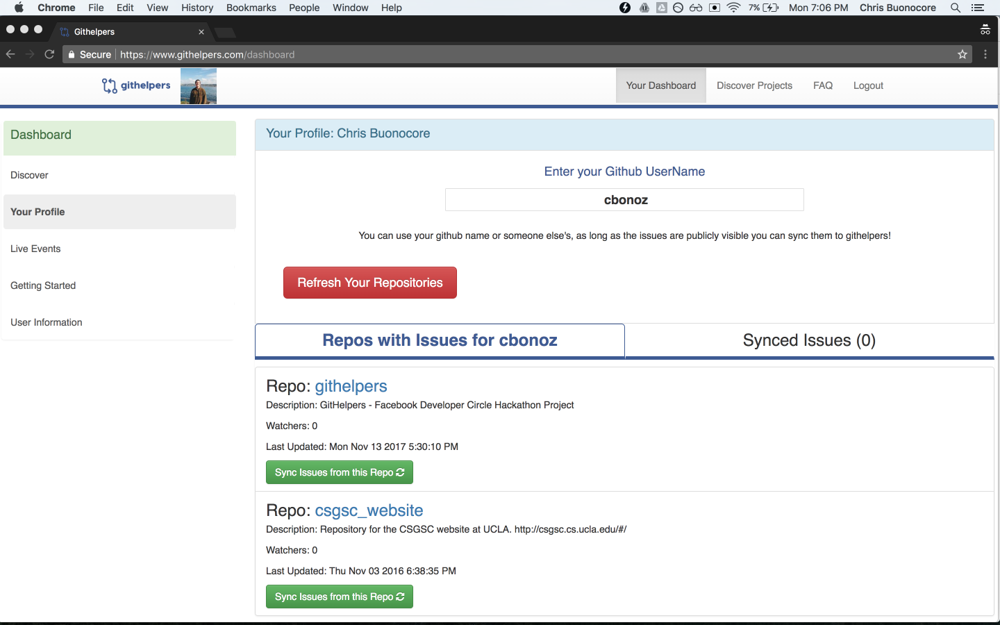
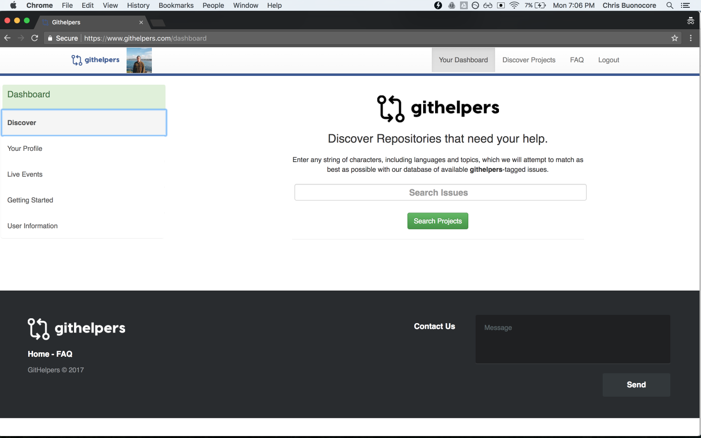

    

Githelpers
--

<h3>Live at: <a href="https://www.githelpers.com">https://www.githelpers.com</a></h3>

Demo: <a href="https://www.youtube.com/watch?v=a_jt1hN8wpg">Githelpers Demo</a>

This is a project for the <a href="https://developercircles.devpost.com/">Developer Circles</a> challenge offered by Facebook.

Githelpers is a platform for connecting with friends around ubilding open source software.

## Description

Contributing to open source can be relatively intimidating. Many people on facebook are not developers, and even for the ones that are, making posts about projects to your facebook wall is not effective in gathering interest for a project. 
 And even with the power of google and github search at your disposal, finding projects and people that are looking for help is not always the easiest task.

That's why we created Githelpers, a new platform for connecting with friends while building open source projects. Githelpers is designed to be a forum *exclusively* for projects that need/want open contributions. And the platform itself is a completely open source solution built with NodeJS and ReactJS on the front end. 

Our goal is to bring friends and open source software community together.

Githelpers is a open source project: 
<a href="https://github.com/cbonoz/githelpers">https://github.com/cbonoz/githelpers</a>

## Facebook Technologies used

* ReactJS
* Account Kit (phone number and full account/email login)
    - Login with the bare minimum (phone number + github handle only, avoid github auth)
    -  Share dialog plugin, appears as button next to each repository in the 'githelpers' active issues search results. https://developers.facebook.com/docs/messenger-platform/discovery/message-us-plugin. This plugin makes it easy to share links to projects with a group of friends, or just one particular friend.

##  What Github offers around encouraging open source:

Github currently has the notion of the following labels: `good-first-timers` and `help-wanted`.

These label s can also be searched on github, but it can still be ambiguous where specific projects need help and from who. These label s can also be difficult to find - requiring advanced search by the end user in order to discover particular labels.

## How it Works

The process of adding a new project on Githelpers is a 3 step process.

1. Create a new github repository
2. Create issues that you would like with on that repository. Tag with the label githelpers
3. Upload your project to the Githelpers website. It will now be searchable by developers around the world.

For every repo that's add to the DB, you can directly invite your friends or connect with the repo owners through facebook.

As developers find your project, there is no lack of understanding or expectations  of whether you are looking for help. All your label ged issues become searchable, and those developers can freely open pull requests on your github repository.

## Where Githelpers differentiates.

<ol>
    <li>Live contribution and user sign up feed.</li>
    <li>Community website around the label s. </li>
    <li>Searchable index around issues that have been explicitly marked.</li>
</ol>

### Screenshots

<h4>Githelpers home page with live activity feed</h4>

Githelpers user dashboard (Profile tab)

Githelpers public issue search (Search tab)

### Future Work

Future work includes:
* Add leaderboard and user contribution history.
* Add ability to chat directly with the repo owner through facebook.
* Implement native integration with github and/or facebook.

### Useful Links
* https://developers.facebook.com/docs/accountkit
* https://developer.github.com/v3/
* http://fontawesome.io/examples/
* https://socket.io/

### Dev Notes

<b>Available Scripts</b>

In the project directory, you can run:

### `npm start`
Runs the app in the development mode. 
Open [http://localhost:3000](http://localhost:3000) to view it in the browser.

The page will reload if you make edits.<br//>
You will also see any lint errors in the console.

### `npm test`
Launches the test runner in the interactive watch mode. 

### `npm run build`
Builds the app for production to the `build` folder. 
It correctly bundles React in production mode and optimizes the build for the best performance.

The build is minified and the filenames include the hashes. 
The app is ready to be deployed!
